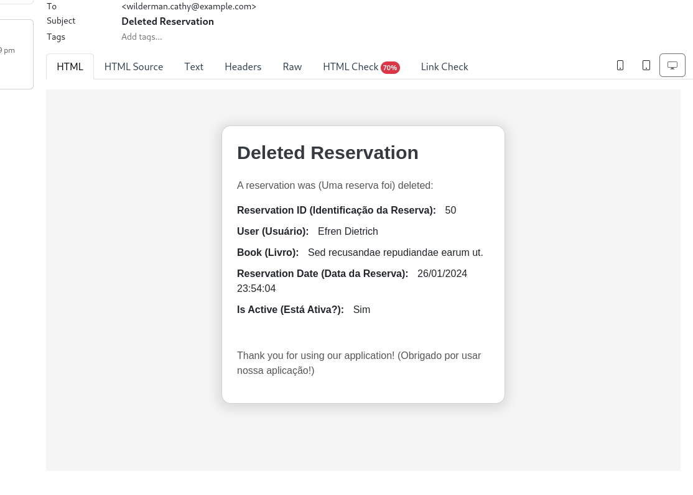

# BookHub: Sistema de Reservas de Biblioteca

O BookHub é um sistema de reserva de biblioteca que gerencia usuários, bibliotecários, livros e reservas. Abaixo estão as entidades principais e seus atributos.

## Primeiros passos:

### Inicialização:

```
./vendor/bin/sail up
```

-   Após isso, execute:

```
composer install
```

-   Você pode instalar as dependências localmente ou utilizar o Docker com o seguinte comando:

```
docker run --rm --interactive --tty \
 --volume $PWD:/app \
 composer install --ignore-platforms-req
```

-   Depois, ative o Passport:

```
./vendor/bin/sail artisan passport:install --force
```

## Usando Mailtrap:

Você pode verificar o envio de e-mail ao registrar um usuário com:

```
./vendor/bin/sail artisan queue:work
```

E acesse: http://localhost:8025

Particularmente, prefiro usar o Mailtrap. Para isso, acesse Mailtrap, faça login, vá em 'Email Testing', crie uma nova Inbox, acesse-a e em integrações, selecione 'PHP 9+'. Em seguida, adapte as credenciais no seu arquivo .env.

## Filtros

-   Para acessar os livros sem filtros, utilize a URL:

    http://localhost/api/books

-   Para paginação, adicione o parâmetro de consulta, como:

    http://localhost/api/books?page=1

-   Para filtrar, você pode usar:

    `Por título`:
    http://localhost/api/books?title=%Seu%Titulo

    `Por autor`:
    http://localhost/api/books?author=%Seu%Autor

    `Por ISBN`:
    http://localhost/api/books?isbn=97812345%

    `Por livros disponíveis`:
    http://localhost/api/books?availability=1

-   Você também pode combiná-los com '&'

-   Todas as rotas index retornam uma paginação se você adicionar o parâmetro de consulta ?page=`numero-da-pagina`

## (Notificações)

<div style="display: flex; justify-content: center; align-items: center; flex-wrap: wrap; gap: 16px;">
    <h2>Notificações aos usuários com 'role_id' === 2 (Bibliotecários): Criação de Reserva</h2>
    <div style=" padding: 16px; text-align: center;">
        
    </div>
        <h2>Notificações aos usuários com 'role_id' === 2 (Bibliotecários): Atualização de Reserva</h2>
    <div style=" padding: 16px; text-align: center;">
        
    </div>
        <h2>Notificações aos usuários com 'role_id' === 2 (Bibliotecários): Deleção de Reserva</h2>
    <div style=" padding: 16px; text-align: center;">
        
    </div>
        <h2>Diagrama do Banco</h2>
    <div style=" padding: 16px; text-align: center;">
        
    </div>
        <h2>Registro de Usuário</h2>
    <div style=" padding: 16px; text-align: center;">
        
    </div>

</div>

## Usuários e Bibliotecários (Users):
### Atributos:
- id: Chave primária, autoincrementada.
- name: Nome completo do usuário.
- email: Endereço de e-mail único para login.
- password: Senha criptografada.
- role_id: Chave estrangeira para Roles, determinando o tipo de usuário - 'Usuário' ou 'Bibliotecário'.
## Funções (Roles):
### Atributos:
- id: Chave primária, autoincrementada.
- name: Nome da função, por exemplo, 'Usuário' ou 'Bibliotecário'.
## Permissões (Permissions):
### Atributos:
- id: Chave primária, autoincrementada.
- name: Nome da permissão, por exemplo, 'Pode Reservar', 'Pode Cancelar Reserva'.
## Livros (Books):
### Atributos:
- id: Chave primária, autoincrementada.
- title: Título do livro.
- author: Nome do autor.
- category: Gênero ou categoria do livro.
- availability: Booleano indicando se o livro está disponível no momento.
## Reservas (Reservations):
### Atributos:
- id: Chave primária, autoincrementada.
- user_id: Chave estrangeira para Users.
- book_id: Chave estrangeira para Books.
- reservation_date: Data em que a reserva foi feita.
- pickup_deadline: Data até a qual o livro deve ser retirado.
- is_active: Booleano indicando se a reserva está ativa ou não.
